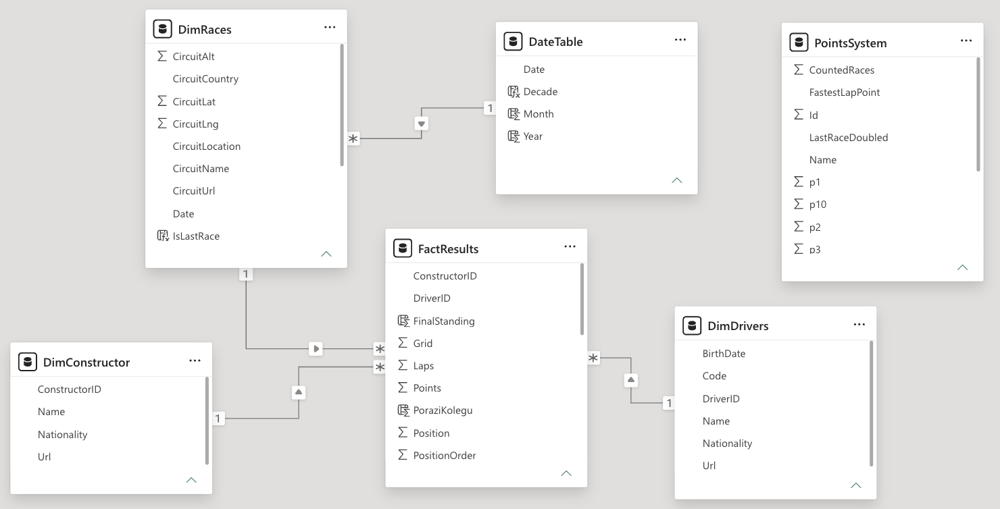
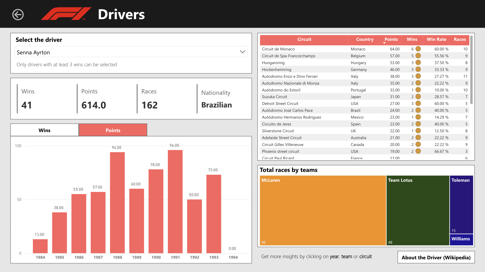
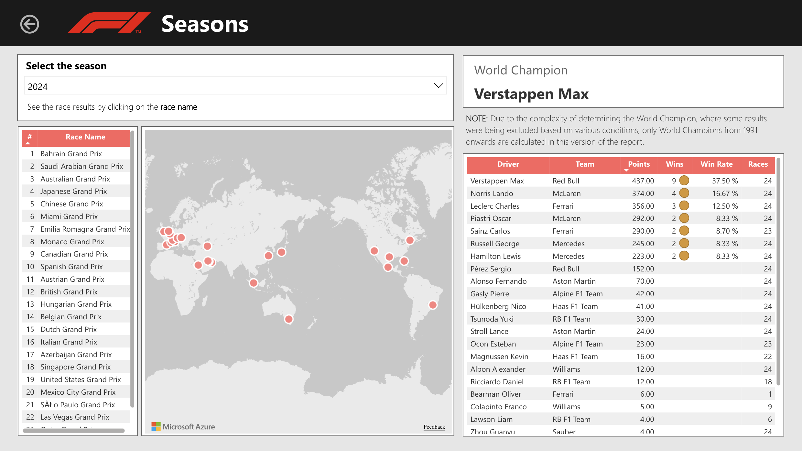
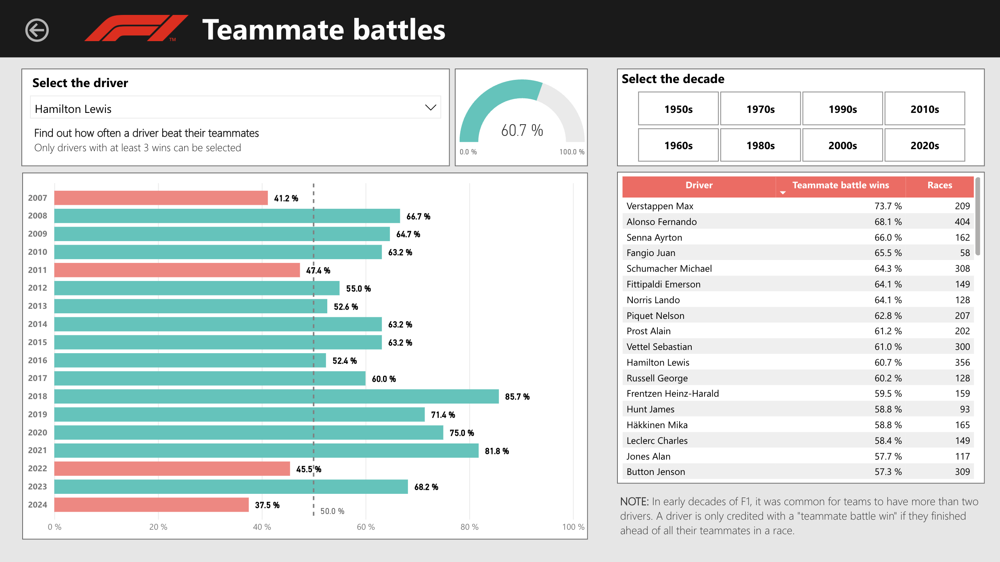
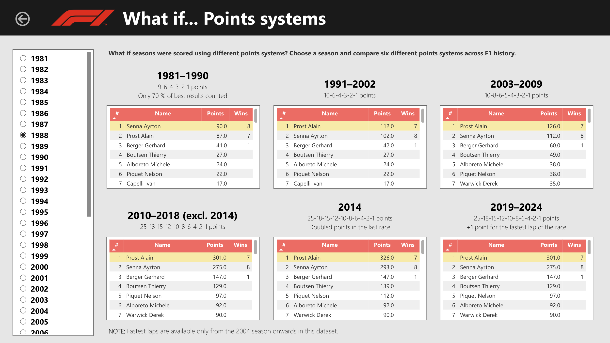

***(The report is currently not available online)***(

# 📖 Introduction

An end-to-end **Power BI project** offering deep, data-driven insights into **Formula 1**. Designed with passion for data and F1, this interactive report transitions from visual historical overviews to complex DAX analytics.

### Key Highlights:
- **Historical Overview & Stats:** Driver statistics and seasonal records across the whole F1 history.
- **Teammate Battles Analysis:** Evaluates driver success rates against teammates in equal machinery (eliminating car performance differences)
- **Historical Points System "What If" scenarios:** Recalculates championship standings using points systems from different F1 eras, proving how slightly altered rules could have reshaped F1 history.

# 🕸️ Semantic model
The report is built on the [Formula 1 World Championship (1950–2024)](https://www.kaggle.com/datasets/rohanrao/formula-1-world-championship-1950-2020) dataset by VOPANI from Kaggle, which originally consists of 14 tables with more than 120 columns.

Raw data were cleaned and transformed in **Power Query**, then modeled into a **Star Schema** model with only single-direction 1:N relationships.

- FactResults – Core fact table combining main race and sprint race results.
- DimRaces – Dimension table combining race details with circuit details.
- DimDrivers – Dimension table containing driver details.
- DimConstructors – Dimension table containing constructor (team) details.
- DateTable - Date dimension for time intelligence operations.
- PointsSystem - Disconnected table with the parameters of all points systems.



# ⚙️ Methodology
The report is structured into four key pages:

## 1. Drivers
Provides statistics for individual drivers, summarizing overall career success and track-specific performance. Implements interactive filtering across multiple visuals, uses dynamic conditional formatting, buttons and bookmarks.



## 2. Seasons
Provides statistics for individual seasons. Uses multiple visuals including map visual.



## 3. Teammate battles
Comparing driver performance is notoriously difficult due to varying car speeds and dominance. To eliminate machinery bias, this page evaluates drivers strictly against their own teammates, who compete with identical equipment.

**DAX Logic:** The calculated column identifies the highest-finishing teammate in each race (situations with more than two cars per team are taken into account) and compares the finishing position to the selected driver. Each race yields a binary win/loss result (100% or 0%). Then the driver's overall success rate over the filtered time frame is calculated.



## 4. What if... Points systems
This section features the most complex DAX calculations of the project. It simulates historical championship outcomes by applying six different points systems used between 1981 and 2024. The parameters for each points system are stored in a disconnected table, ensuring full scalability to easily incorporate additional points systems in the future.

| Id | Name | FastestLapPoint | CountedRaces | LastRaceDoubled | p1 | p2 | p3 | p4 | p5 | p6 | p7 | p8 | p9 | p10 |
|---:|:--------------------|-----------------:|-------------:|----------------:|---:|---:|---:|---:|---:|---:|---:|---:|---:|----:|
| 1 | 2019 – 2024 | 1 | 1 | 0 | 25 | 18 | 15 | 12 | 10 | 8 | 6 | 4 | 2 | 1 |
| 2 | 2010 – 2018 (ex 2014) | 0 | 1 | 0 | 25 | 18 | 15 | 12 | 10 | 8 | 6 | 4 | 2 | 1 |
| 3 | 2014 | 0 | 1 | 1 | 25 | 18 | 15 | 12 | 10 | 8 | 6 | 4 | 2 | 1 |
| 4 | 2003 – 2009 | 0 | 1 | 0 | 10 | 8 | 6 | 5 | 4 | 3 | 2 | 1 | 0 | 0 |
| 5 | 1991 – 2002 | 0 | 1 | 0 | 10 | 6 | 4 | 3 | 2 | 1 | 0 | 0 | 0 | 0 |
| 6 | 1981 – 1990 | 0 | 0.7 | 0 | 9 | 6 | 4 | 3 | 2 | 1 | 0 | 0 | 0 | 0 |

**DAX Logic:** The process is divided into six parts, each with a specific scoring rule, that together calculate the total points:
1. **Number of counted best results** – Determines the number of top finishes that count toward the final standings. The measure sorts a driver's finishes from best to worst, calculates the required quota based on total races in that season, and isolates those specific results.
2. **Position-based points** – Awards the appropriate points for the results filtered above.
3. **Half-Points** – There were only six races in F1 history with half points due to shortened races. If that race is detected, awarded points are divided by two.
4. **Double-points in the last race** – If the race is the last race of the season, points can be doubled.
5. **Fastest lap point** – Checks if the driver achieved the race's fastest lap and meets the required top-10 finishing condition, then he can get the bonus point.
6. **Sprint race points** – Adds points from sprint race. The sprint race points system remains the same in all cases.

<details>
<summary>👉 Click here to expand DAX syntax</summary>

```
PointsCalculated = 
FactResults[PointsForPosition2] + FactResults[PointsForLaps] + SUM(FactResults[SprintPoints])
```

```
PointsForPosition2 = 

VAR PocetZavodu =
    ROUND(MAX(DimRaces[Round]) * SELECTEDVALUE(PointsSystem[CountedRaces]), 0)

VAR TopDriverRows =
TOPN(
    PocetZavodu,
    FactResults,
    FactResults[PositionOrder], ASC,
    FactResults[RaceID], ASC
)
RETURN
SUMX (
    TopDriverRows,
    VAR Body = SWITCH (FactResults[Position],
        1, SELECTEDVALUE(PointsSystem[p1]),
        2, SELECTEDVALUE(PointsSystem[p2]),
        3, SELECTEDVALUE(PointsSystem[p3]),
        4, SELECTEDVALUE(PointsSystem[p4]),
        5, SELECTEDVALUE(PointsSystem[p5]),
        6, SELECTEDVALUE(PointsSystem[p6]),
        7, SELECTEDVALUE(PointsSystem[p7]),
        8, SELECTEDVALUE(PointsSystem[p8]),
        9, SELECTEDVALUE(PointsSystem[p9]),
        10, SELECTEDVALUE(PointsSystem[p10])
    )

VAR BodyZkraceneZavody =
    IF (RELATED(DimRaces[RaceID]) IN {1063, 2, 320, 441, 587, 579}, Body/2, Body)

RETURN 
    IF (RELATED(DimRaces[IsLastRace]) = TRUE && SELECTEDVALUE(PointsSystem[LastRaceDoubled]) = TRUE(),
        BodyZkraceneZavody * 2,
        BodyZkraceneZavody
        )
)
```

```
PointsForLaps = 
IF(
    SELECTEDVALUE(PointsSystem[FastestLapPoint]) = TRUE(),
    SUMX(
        FILTER(
            FactResults,
            FactResults[PointsForPosition] > 0
                && FactResults[RankFastestLap] = 1
        ),
    1)
)
```

</details>

<br>
<br>




# 🔥 Key Findings

This report provides some interesting insights that may not be commonly known or tracked by usual F1 statistics. Some of these are below:

- **World Champions' teammate battle success** – No suprise that on the top of the teammate battles ranking there are World Champions such as Max Verstappen, Fernando Alonso or Ayrton Senna. Interestingly, Lewis Hamilton ranks slightly lower — primarily because he spent a significant part of his career competing alongside some other World Champions.
- **Senna vs. Prost 1988** – While Ayrton Senna won the 1988 World Championship, Alain Prost scored more total points and would have won the title under all five other scoring systems.
- **Hamilton vs. Massa 2008** – Under three out of the six historical points systems, Felipe Massa would have become the 2008 World Champion instead of Lewis Hamilton.
- **Rosberg vs. Hamilton 2016** – If the 2014 double-points finale rule had remained active in 2016, Lewis Hamilton would have taken the title instead of Nico Rosberg.

# 💡 What's Next?
The flexibility of this dataset leaves almost unlimited possibilities for future:

- Teammate Quality Index – Enhancing the Teammate battles calculation by weighting results based on the strength of the teammate for even more accurate insights.
- Pit Stop Analysis – Using the dataset's pit stop table to analyze execution speeds across different eras and calculate the direct impact of fast pit stops on gaining positions.

*... and so much more. Come back soon for new updates! 🏎️💨*
